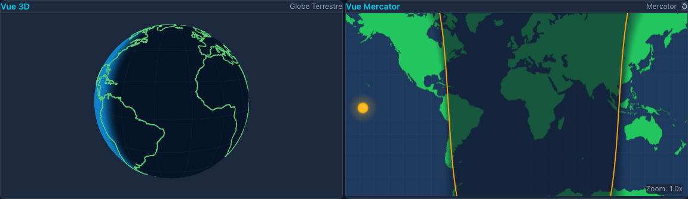

# U-Earth

Visualisation interactive du système Terre-Soleil. Plusieurs vues synchronisées (globe 3D, cartes
Mercator et azimutale, système solaire, rayons du Soleil) pour voir comment le jour, la nuit et les
saisons se répartissent sur la Terre, et comment les cartes planes déforment tout ça.

**Démo : [hugoprigent.github.io/uearth](https://hugoprigent.github.io/uearth/)**



## Ce que ça montre

- **La ligne jour/nuit** est calculée à partir de la position du Soleil (déclinaison selon le jour de
  l'année, longitude selon l'heure UTC), pour n'importe quelle date.
- **Les distances** : une ligne tracée sur une vue est reportée sur toutes les autres avec sa longueur
  réelle. Une droite sur Mercator devient une courbe sur le globe, et inversement.
- **La carte azimutale**, celle qu'utilisent les modèles « Terre plate » : en hiver, la zone éclairée
  y prend une forme de haricot, alors qu'un soleil-projecteur au-dessus d'un disque éclairerait une zone
  à peu près circulaire.
- **La page « Terre plate »** modélise le disque, le dôme et le soleil qui tourne au-dessus, pour
  comparer ce que ce modèle prédit avec le globe.
- **Le système solaire** : orbite elliptique (exagérée), inclinaison de l'axe à 23,5°, distance
  Terre-Soleil calculée avec l'équation de Kepler.

## Stack

React 19, TypeScript, Vite · React Three Fiber (vues 3D) · d3-geo (projections) · Zustand (état
partagé entre les vues) · Tailwind CSS. Données géographiques : Natural Earth 1:110m via
[world-atlas](https://github.com/topojson/world-atlas).

## Lancer en local

```bash
npm install
npm run dev
```

Puis ouvrir http://localhost:5173/uearth/. `npm run build` produit le site statique dans `dist/` ;
chaque push sur `main` le déploie sur GitHub Pages.

## Organisation du code

```
src/
├── App.tsx                  # page principale, grille des vues
├── pages/FlatEarthPage.tsx  # modèle Terre plate (3D + carte 2D)
├── components/              # une vue par fichier + panneau de contrôle
├── store/geoStore.ts        # état partagé : date, lignes tracées, vues actives
├── utils/solarCalculations.ts  # point subsolaire, terminateur, grands cercles, orbite
└── hooks/useWorldData.ts    # chargement des contours des continents
```

## Licence

[MIT](LICENSE)
